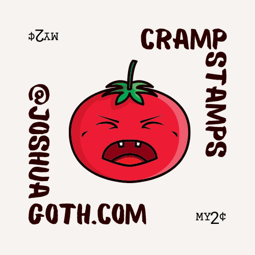

+++
date = '2025-10-20T01:58:51-07:00'
title = 'Four'
author = 'Joshua Goth'
image = 'img/JG_Crow.png'
tags = ["logo", "sticker", "CrampStamp"]
categories = ["Projects", "Mental Health"]
archives = ["2025/10"]
+++

 
 Testing by creating /post/four/index.md instead of /post/four.md. Trying to see which uniformity flows. 
 Logo
 
 
 Logo works with /img/. Need to get logo working from within content folder 
 The above image works when I set image location to /post/four/cramp.png
 
 Image from directly within the container folder:  - Works on Hugo Server. Lets see which works when publishing online.
 
